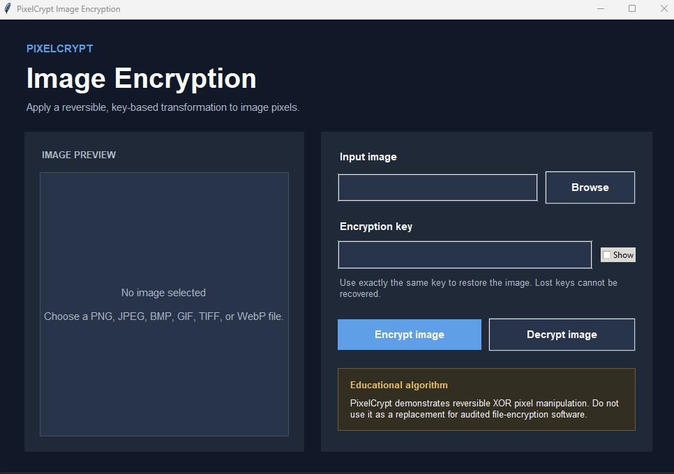

# 🔐 PixelCrypt Image Encryption

> **Task 02:** A Python desktop application that encrypts and decrypts images through reversible pixel manipulation. PixelCrypt applies a key-derived XOR operation to every red, green, and blue channel while preserving image dimensions and transparency.

<p align="left">
  
  
  
  
</p>

---

## 📌 Task Objective

Develop a simple image-encryption tool using pixel manipulation. The program must allow users to:

- Select an image.
- Enter an encryption key.
- Apply a reversible mathematical operation to pixel values.
- Save the encrypted image.
- Decrypt the image later using the same key.

## ✨ Features

- Reversible key-based pixel transformation.
- Encrypt and decrypt controls in a clean Tkinter interface.
- Preview of the selected source image.
- Support for PNG, JPEG, BMP, GIF, TIFF, and WebP input.
- Lossless PNG output for reliable decryption.
- Preserves the alpha/transparency channel.
- Handles processing in a worker thread to keep the interface responsive.
- Validates missing files, empty keys, and output formats.
- Includes automated round-trip and integrity tests.
- Includes a Windows executable builder.

## 📸 Screenshot Holders

Replace these holders with screenshots saved in the `screenshots/` folder.

| Main interface | Image selected |
| --- | --- |
| **Screenshot holder**<br>`screenshots/main_interface.png` | **Screenshot holder**<br>`screenshots/image_selected.png` |

| Encrypted result | Decrypted result |
| --- | --- |
| **Screenshot holder**<br>`screenshots/encrypted_result.png` | **Screenshot holder**<br>`screenshots/decrypted_result.png` |

### Required Screenshot Names

1. `main_interface.png`
2. `image_selected.png`
3. `encrypted_result.png`
4. `decrypted_result.png`

After adding each image, replace its holder with Markdown such as:

```markdown

```

## 🧠 How It Works

1. PixelCrypt converts the selected image to RGBA format.
2. It hashes the user-provided key with SHA-256.
3. It derives a deterministic byte stream from that hash.
4. Each red, green, and blue byte is combined with a key-stream byte using XOR.
5. The alpha byte is left unchanged.
6. Applying the same operation again with the same key restores the original pixels.

```text
Encrypted channel = Original channel XOR Key-stream byte
Original channel  = Encrypted channel XOR Key-stream byte
```

XOR is self-inverse, which makes the same transformation suitable for encryption and decryption.

## 🚀 Installation

### 1. Clone the repository

```bash
git clone https://github.com/AvatarParzival/PixelCrypt-Image-Encryption.git
cd PixelCrypt-Image-Encryption
```

### 2. Create a virtual environment

```bash
python -m venv venv
```

Activate it:

```bash
# Windows
venv\Scripts\activate

# Linux or macOS
source venv/bin/activate
```

### 3. Install requirements

```bash
pip install -r requirements.txt
```

### 4. Run PixelCrypt

```bash
python pixelcrypt.py
```

## 🖥️ Usage

### Encrypt an image

1. Select **Browse** and choose a source image.
2. Enter a key you can remember.
3. Select **Encrypt image**.
4. Save the result as a PNG file.

### Decrypt an image

1. Select the encrypted PNG.
2. Enter exactly the same key.
3. Select **Decrypt image**.
4. Save the restored result as a new PNG file.

> A wrong key produces an incorrect image. PixelCrypt does not store or recover keys.

## 📦 Build a Windows Executable

Double-click `build_exe.bat`. It installs the requirements and PyInstaller, then creates:

```text
dist\PixelCrypt.exe
```

You can also start the builder from Command Prompt:

```bat
build_exe.bat
```

## ✅ Run the Tests

```bash
python -m unittest -v
```

The tests verify:

- Exact encryption/decryption round trips
- RGB-value transformation
- Alpha-channel preservation
- Wrong-key behavior
- Empty-key validation
- File-based processing
- PNG output enforcement

## 📁 Project Structure

```text
PixelCrypt-Image-Encryption/
├── pixelcrypt.py
├── pixel_cipher.py
├── test_pixel_cipher.py
├── requirements.txt
├── build_exe.bat
├── screenshots/
│   └── README.md
├── LICENSE
└── README.md
```

## ⚠️ Important Limitations

- Encrypted output must remain in a lossless format such as PNG. Saving it as JPEG changes pixel values and prevents exact recovery.
- PixelCrypt demonstrates reversible pixel manipulation; it is not a replacement for audited encryption tools such as age, GPG, VeraCrypt, or operating-system file encryption.
- The format does not provide authentication, tamper detection, metadata protection, or secure key management.
- Do not rely on this project to protect highly sensitive, medical, financial, legal, or confidential information.

## 🧑‍💻 Author

Created and maintained by **Abdullah Zubair**.

- GitHub: [@AvatarParzival](https://github.com/AvatarParzival)
- LinkedIn: [Abdullah Zubair](https://www.linkedin.com/in/abdullahzubairr)
- Email: [abdullah69zubair@gmail.com](mailto:abdullah69zubair@gmail.com)

## 📄 License

Released under the [MIT License](LICENSE). You may use, modify, and distribute this project under the license terms.
